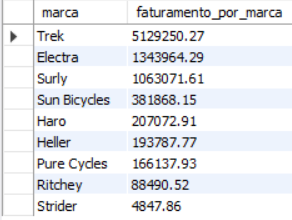

# BIKE STORE

## Revenue and sales

The database was obtained through Kaggle, and consists of 9 tables, as shown below

In this project, I chose to use CTE extensively in my queries.

Firstly, I analyzed the store's revenue per product and brand.

The brand that generated the most revenue was Trek, and the product that generated the most revenue was Trek Slash 8 27.5 - 2016. 

After that, I discovered the most popular product from each brand, and also the most popular product from each category, as shown in the figures below

## Stores

## Customers

