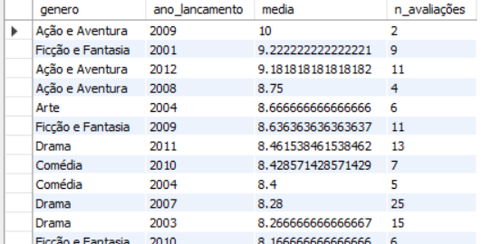
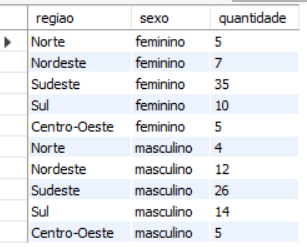
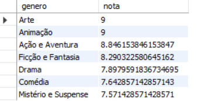
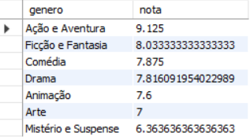
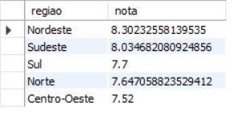
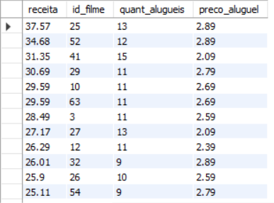

# Project "Hashtag Movies"

Project idea and database provided by Hashtag Programação.

Hashtag Movie is a fictional movie rental company.

The database is made up of 5 tables, as follow:

## Customer satisfaction with the catalog 

Firstly, I assessed customer satisfaction with the service, based on the overall average rating of the films offered.

We observed that the sample consists of 578 rentals, referring to 71 films, and that 43% of rented films were not rated.

The average, disregarding null values, is 7.9, which can be considered average satisfaction. Among the available assessments, we observed that 58.8% had an above average score.

What to do to increase customer satisfaction? Invest in the films that customers like most.

To do this, we need to find out which genres have the best rating in the catalog.

Looking at the average by genre, we see that 4 are above average: Action and Adventure, Art, Fiction and Fantasy and Animation. Among which,
the two with the highest average are Action and Adventure and Art.

We can also go further and look for the genre with the highest number of excellent reviews (10 and 9).

In absolute numbers, we observed a predominance of Drama films receiving excellent ratings, but, in percentage terms, this predominance does not prevail, as there is a predominance of the drama genre among the films rented.
The predominance of excellent reviews belongs to the Action and Adventure genre, with 71.4% of reviews 9 and 10, followed by the Art genre, with 66.7%.

I also looked at how ratings are distributed by year of film release.
We observe that, grouping the averages by year, the years with films with ratings above the average are, in order:
2009,2012,2001,2004,2007 and 2014.

I also grouped the average by year of release and genre, for a more complete analysis.

And, considering that the majority of rented films were drama films, although poorly rated, seeking to increase customer satisfaction, I investigated in which year the highest rated drama films were produced, in order to improve the quality of films of this genre, which is the most searched.

Therefore, we observe that Hashtag Movie should invest in Action and Adventure films (especially from 2009 and 2012) and Art.
It is also interesting to invest in Fiction and Fantasy films from 2001, and Drama films from 2011.

## Customer engagement and preference by gender and region.

Analyzing the customers table, it is clear that there is no significant difference between men and women, and that the majority are from the southeast, with 49.6% of subscriptions

Analyzing preferences based on the genres best rated by each sex, we see that men prefer Action and Adventure films, followed by Fiction and Fantasy, while women prefer Art and Animation films.

Now, analyzing preferences by region, the following was found:

- Northeast prefers Action and Adventure
- North prefers Comedy and Animation
- Southeast prefers Art and Action and Adventure
- South prefers Action and Adventure
- Midwest prefers Comedy (Art and Action and Adventure also highly rated)

Finally, I analyzed average customer satisfaction by region, and the following was observed:

- South, Southeast and Central-West are rated below average. They are, therefore, the least satisfied with the catalogue.

In this sense, it may be interesting to invest in films that appeal more to these audiences, which were mentioned above.

## Company revenue

Evaluating the company's revenue through the number of locations, it was found that the company's total revenue was R$1275.72, where each film contributed to total revenue as follows:

